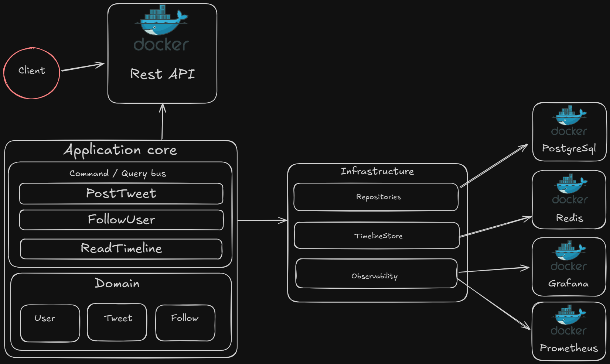

# Social Network

Este proyecto implementa una red social simplificada similar a Twitter.

Features incluidos:
- Creación de usuarios
- Publicación de tweets
- Seguir / dejar de seguir usuarios
- Timeline con tweets de los usuarios seguidos
- 
---

## ▶️ Ejecución
Docker Compose

Levanta la API + Postgres + Redis + Prometheus + Grafana:

```bash
docker compose up -d --build
```

## 🧪 Tests

Ejecutar todos los tests:

```bash
./gradlew test
```

## 📊 Servicios disponibles:

API: http://localhost:8080

Prometheus: http://localhost:9090

Grafana: http://localhost:3000

Usuario/contraseña Grafana por defecto: admin / admin

## Diagrama de arquitectura


